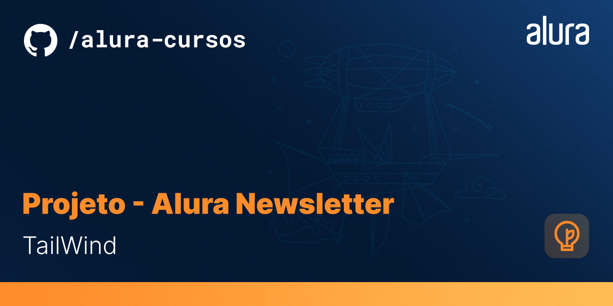

# Projeto-newsletter-tailwind

# Resumo do projeto

Projeto da página de inscrição de uma newsletter fictícia com foco em práticar e estilizar a mesma utilizando somente o Tailwind.

# ✔️ Técnicas e tecnologias utilizadas

 
 

 

# 📁 Acesso ao projeto

Você pode acessar os arquivos do projeto clicando [aqui](https://github.com/mvergara94/newsletter-tailwind/find/main). E o link através do Github pages é [este](https://mvergara94.github.io/newsletter-tailwind/).

# Screenshot
 

 

# ✉️ Redes Sociais

 

 
   
   

  
 

